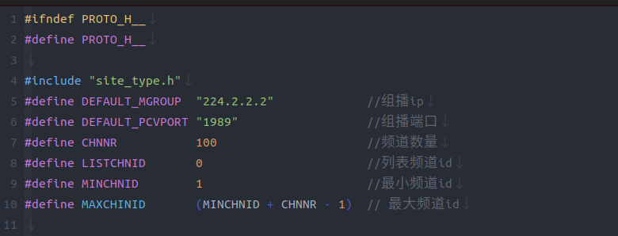
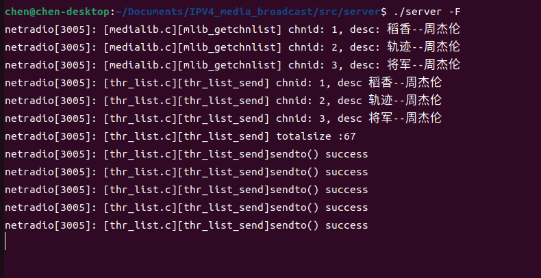
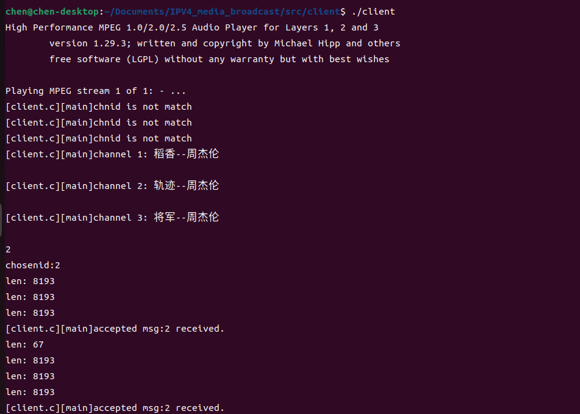

# linux_IPV4_流媒体广播

### 介绍

B站李慧琴linux课程流媒体广播项目，用到流量控制，多线程并发，线程间通信，socket网络套接字等等。


### 软件架构

这个一个基于多线程，多进程，网络报式套接字的流媒体广播项目，包括服务端和客户端和全局配。

#### 1.服务端( ` /src/server ` )

服务端负责读取媒体库下频道列表并通过报式套接字（UDP）发送到自己创建的组播地址种。一个频道包含频道的描述信息和媒体文件（媒体文件可以有多个），读取到的所有频道列表信息（包括描述信息和频道号）由一个线程（频道id = 0）负责发送出去。每一个频道都会创建一个自己线程，负责发送媒体文件数据，媒体文件数据的读取都会进行流量控制。

模块

* medialib: 读取/share/media/下所有频道信息。
* thr_list: 创建一个线程用于发送频道列表信息。
* thr_channel: 创建一一对应的频道线程用于发送频道媒体文件数据。
* mytbf: 令牌桶，用于流量控制。
* server: 主函数入口。

默认媒体库路径:   ` /share/media/ `

默认描述文件类型: ` desc.text `

存放格式

```
    |-- share
    |-- media
        |-- ch1
            |-- desc.text
            |-- 1.mp3
        |-- ch2
            |-- desc.text
            |-- 2.mp3
```

#### 2.客户端( `/src/client ` )

加入并接受多播组中的频道列表信息，并让用户做选择，选择一个频道并接受选择频道的媒体数据并播放。客户端有两个进程，一个父进程和一个子进程，父进程负责接受网络数据包并发送给子进程，子进程负责接收数据并播放，父子进程间的通信采用匿名管道。

模块

client： 主函数入口。

#### 3.全局配置头文件( ` /src/include/  `)

默认多播组地址： ` 224.2.2.2 ` （可选范围：224.0.0.0 ~ 239.255.255.255）。


### 安装教程

git
` git clone https://gitee.com/cgbfg/IPV4_media_broadcast.git` 


### 使用说明

1.  先启动服务，进入` /src/server `，运行 ` make `，在运行 ` ./server -[option] [arg]`。
```
配置项:
 * -M  指定多播组
 * -P  指定端口
 * -F  前台运行
 * -D  指定媒体库位置
 * -I  指定网路设备
 * -H  显示帮助
```
2.  再启动客户端，进入` /src/client `，运行 ` make `，在运行 ` ./client -[option] [arg]`。
```
配置项:
 * -M --mgroup 指定多播组
 * -P --port   指定接收端口
 * -H --help   显示帮助
 * -p --player 指定播放器
```


### 运行截图

1. 全局配置

   

2. 服务端

   

3. 客户端

   

   

### 参与贡献

1.  Fork 本仓库
2.  新建 Feat_xxx 分支
3.  提交代码
4.  新建 Pull Request

